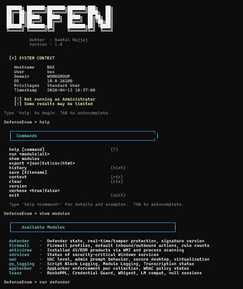

# DefenseEnum

DefenseEnum is a powerful and interactive PowerShell-based security and defense enumeration tool designed by Nawfal Hajjaj. It enables security researchers, penetration testers, and system administrators to quickly evaluate the security posture of a Windows endpoint by querying various defense-related configurations and services.



## Features

DefenseEnum groups its checks into several distinct modules to give you comprehensive visibility:

- **defender**: Checks Windows Defender state, real-time protection, tamper protection, and signature versions.
- **firewall**: Enumerates firewall profiles, default inbound/outbound actions, and rule counts.
- **antivirus**: Identifies installed AV and EDR products through WMI and process scanning.
- **services**: Verifies the status of critical Windows security services.
- **uac**: Evaluates User Account Control (UAC) level, admin prompt behavior, secure desktop, and virtualization.
- **ps_logging**: Checks for PowerShell Script Block Logging, Module Logging, and Transcription status.
- **applocker**: Determines AppLocker enforcement policies per collection and WDAC policy status.
- **lsass**: Analyzes Local Security Authority Subsystem Service (LSASS) protections, including RunAsPPL, Credential Guard, WDigest, LM Compatibility, and null sessions.

## Usage

You can run DefenseEnum in both interactive and non-interactive (command-line) modes.

### Interactive Mode

Simply start the script without any parameters to enter the interactive console, which provides an easy-to-use shell with autocomplete.

```powershell
.\main.ps1
```

Once inside the interactive shell, you can use the following commands:
- `help [command]` - Show the command list or detailed info for a specific command.
- `run <module|all>` - Execute one or more enumeration modules (e.g., `run defender`, `run all`).
- `show modules` - List all registered modules and their summaries.
- `export <json|txt|csv|html>` - Save current results to a structured format.
- `save [filename]` - Save results to a text file.
- `verbose <true|false>` - Toggle verbose mode.
- `history` - Show command history.
- `context` - Display the context of the system.
- `clear` - Clear the terminal.
- `exit` - Close the console.

### Non-Interactive Mode

You can run DefenseEnum systematically using the `-Mode` parameter:

- **Quick mode** (Defender checks only):
  ```powershell
  .\main.ps1 -Mode quick
  ```

- **Full mode** (All checks):
  ```powershell
  .\main.ps1 -Mode full
  ```

- **Stealth mode** (No banners, silent execution):
  ```powershell
  .\main.ps1 -Mode stealth
  ```

Add the `-ShowSource` flag to output exactly which registry keys or cmdlets are being executed under the hood for educational or verification purposes (same as verbose mode in CLI).

```powershell
.\main.ps1 -Mode full -ShowSource
```

## Results Export

DefenseEnum natively supports saving your findings securely for reporting purposes. Use the `export` command in interactive mode to generate `.html`, `.csv`, `.json`, or `.txt` reports mapping findings to risk levels (HIGH, MEDIUM, LOW).

## Requirements

- PowerShell 5.1 or later.
- Running as Administrator is recommended for accurate and complete enumeration, notably for tools accessing root registry keys and advanced service status.
